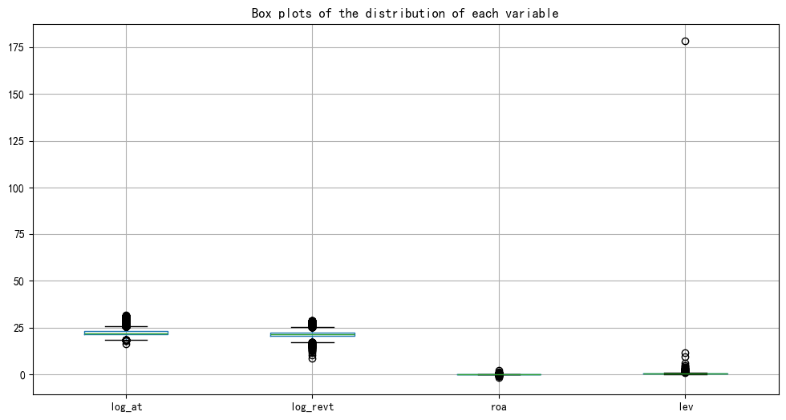
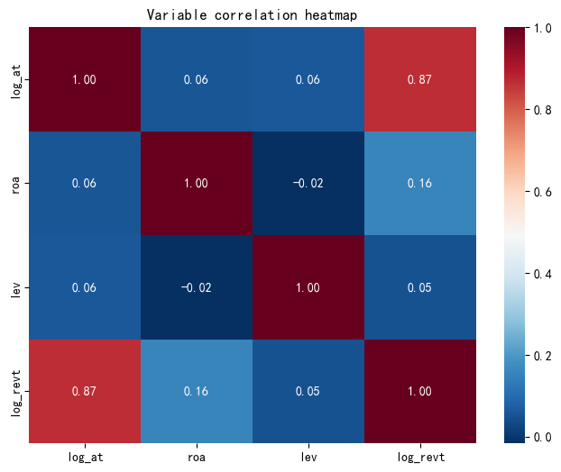
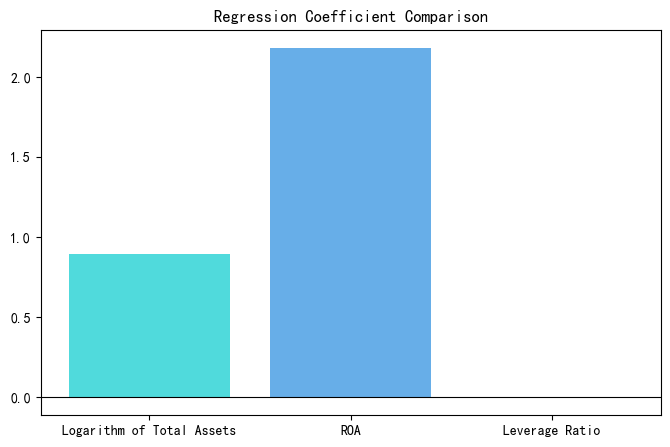

# Listed-Firm-Revenue-Analysis
Python analysis of listed companies' revenue based on linear regression models.
# A-Share Listed Firm Revenue Health Analysis
A professional, ready-to-use revenue health diagnosis template for all enterprises.  
This project uses multiple linear regression to analyze the key drivers of operating income: total assets, ROA, and leverage ratio.

---

## 📌 What This Template Solves
This tool helps any business answer 3 critical questions about revenue health:
1. Is revenue growth driven by **scale (total assets)** or **real profitability efficiency (ROA)**?
2. Does adding leverage improve revenue? Or does it only increase risk?
3. What is the **real impact** of each financial factor on revenue?

---

## 🎯 Purpose
This is a **universal revenue health diagnosis template** for enterprises.  
It transforms financial data into clear, data-driven insights for decision-making.

---

## 📊 Analysis Model & Methodology
- **Data Source**: WRDS (Wharton Research Data Services) A-share listed firms' financial data
- **Model**: Multiple Linear Regression (OLS) with HC3 robust standard errors
- **Target Variable**: Operating Income
- **Key Factors**:
  - Total Assets (Business Scale)
  - ROA (Return on Assets, Profitability Efficiency)
  - Leverage Ratio (Risk & Debt Strategy)
- **Sample Size**: 25,795 observations

---

## 📈 Key Model Results
- **R-squared**: 0.765 → The model explains 76.5% of the variation in operating income.
- **Key Findings**:
  - ✅ **Total Assets (Scale)** and **ROA (Efficiency)** are statistically significant, positive drivers of revenue.
  - ⚠️ **Leverage Ratio** shows no statistically significant impact on revenue, suggesting debt does not reliably boost operating income.
- **Robustness**: Heteroscedasticity-consistent (HC3) standard errors are used to ensure reliable inference.

---

## 📊 Full Analysis Visualizations

### 1. Variable Distribution (Box Plots)

Shows the distribution and outliers of key financial variables, supporting data cleaning and preprocessing steps.

### 2. Correlation Heatmap

Visualizes pairwise correlations between variables, confirming no severe multicollinearity issues in the regression model.

### 3. Regression Coefficient Bar Chart

Compares the impact direction and strength of each factor on revenue.

---

## 🚀 Getting Started

### 1. Install Dependencies
```bash
pip install wrds pandas numpy matplotlib scipy statsmodels scikit-learn seaborn
